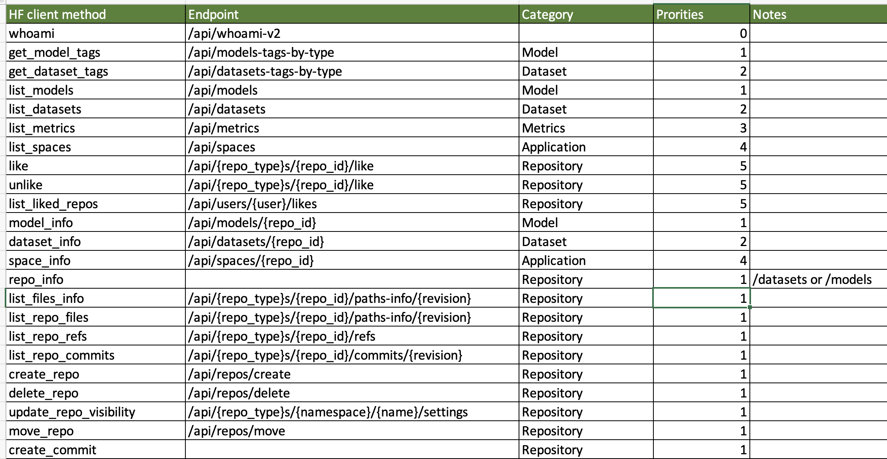

# Transformerz
A private hub for huggingface transformers hosting on your AWS/Azure/GCP Cloud.

# Problem
An enterprise company requires a secure and compliant running environment for easily developing a Generative AI model, without relying on cloud public services. In Modern Cloud world, customer find that public cloud platforms increasingly expensive and complex to manage. Hugging face stopped the private hub for enterprise [https://huggingface.co/blog/introducing-private-hub](https://huggingface.co/datasets)  since 2023, Q1.
# Requirements
## 1. Not only public Sass Solution
The ideal solution should not be limited to deploying the Generative AI model solely in a shared and SaaS environment within a single geographic region. Instead, it should offer the flexibility to deploy the model in a private and customized network, as well as across various cloud providers. This would enable enterprises to choose the deployment environment that best suits their security, compliance, and cost requirements.
## 2. Multi-Cloud Agnostic Deployment
n the complex enterprise IT environment, which often involves legacy platforms and multiple cloud providers, the solution should be capable of deploying the Generative AI model across various environments such as AWS, Azure, GCP, and K8S. Specifically, it should support deployment in Western European markets to cater to the regional needs and regulations.
## 3. Full backend Compatibility API
The server api need to be compatible with Huggingface Hub API  https://huggingface.co/docs/hub/api
## 4. Simple UI for Models, Datasets, Applications
A user-friendly and simple UI is required to facilitate developers in discovering models, datasets, and applications in a simple and streamlined manner. The UI should prioritize simplicity and cleanliness, ensuring that developers can easily navigate and explore available resources.
# Solution Architecture Overview
## 1. System Block OverView

## 2. Deployment OverView

# Features
## Backend API
Please download the full api list table [link here](/docs/HuggingfaceAPI.xlsx) !!!

## Frontend UI 
1. Models: list all models by tags like [https://huggingface.co/models](https://huggingface.co/models) 
2. Datasets: list all datasets by tags like [https://huggingface.co/datasets](https://huggingface.co/datasets)
3. Spaces: List all the Spaces(Application) template [https://huggingface.co/spaces](https://huggingface.co/spaces)

